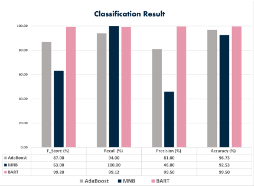
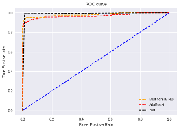

# EmailSpamOrNot

## Evaluation Metrics
1. Metrics:
2. F-score
3. Precision
4. Recall
5. Accuracy
6. AUC score
 	 
## Results

- BART had the best average accuracy rate of 99.50%
- BART also had the best performance considering other metrics, except recall
- The best recall was for MNB equal to 100%, which refers to the percentage of total relevant results correctly classified by the model.
- BART has been identified as the best classifier in differentiating between spam and non-spam emails, considering F_score, precision, and accuracy


- As shown in this figure, the area under ROC curve for  BART is bigger the other two models. Therefore, it reveals that it is the best model at distinguishing spam emails
- To conduct time analysis, we have studied the run time of each classifier. MNB had the minimum average run time of 43 seconds. After that, AdaBoost and BART are on the following levels with 1:42 seconds and 3:37 seconds, respectively


## How to run ?

```git clone https://github.com/Project-Team-B3-COMP8790/EmailSpamOrNot```

GitHub Link --- https://github.com/Project-Team-B3-COMP8790/EmailSpamOrNot

Define the correct path for the dataset

run the cell in jupyte notebook or colaboaratory

The results will be displayed in, output screen of the cell

## Presentation Video

[](https://www.youtube.com/watch?v=W3Jw82xNQDw)

## References
1. R Kishore Kumar, G Poonkuzhali, and P Sudhakar. “Comparative study on email spam classifier using data mining techniques”. In: Proceedings of the International MultiConference of Engineers and Computer Scientists. Vol. 1. 2012, pp. 14–16.
2. Sunday Olusanya Olatunji. “Improved email spam detection model based on support vector machines”. In: Neural Computing and Applications 31.3 (2019), pp. 691–699.
3. Shafi’i Muhammad Abdulhamid et al. “Comparative Analysis of Classification Algorithms for Email Spam Detection.” In: International Journal of Computer Network & Information Security 10.1 (2018).
4. Adel Hamdan Mohammad and Raed Abu Zitar. “Application of genetic optimized artificial immune system and neural networks in spam detection”. In: Applied Soft Computing 11.4 (2011), pp. 3827–3845.
5. Serkan G¨unal et al. “On feature extraction for spam e-mail detection”. In: International Workshop on Multimedia Content Representation, Classification and Security. Springer. 2006, pp. 635–642.
6. Hossam Faris et al. “An intelligent system for spam detection and identification of the most relevant features based on evolutionary random weight networks”. In: Information Fusion 48 (2019), pp. 67–83.
7. Thiago S Guzella and Walmir M Caminhas. “A review of machine learning approaches to spam filtering”. In: Expert Systems with Applications 36.7 (2009), pp. 10206–10222.
8. Enrico Blanzieri and Anton Bryl. “A survey of learning-based techniques of email spam filtering”. In: Artificial Intelligence Review 29.1 (2008), pp. 63–92.
9. Masurah Mohamad and Ali Selamat. “An evaluation on the efficiency of hybrid feature selection in spam email classification”. In: 2015 International Conference on Computer, Communications, and Control Technology (I4CT). IEEE. 2015, pp. 227–231.
10. Karthika D Renuka and P Visalakshi. “Latent semantic indexing based svm model for email spam classification”. In: (2014).
11. Matthew Woitaszek, Muhammad Shaaban, and Roy Czernikowski. “Identifying junk electronic mail in Microsoft outlook with a support vector machine”. In: 2003 Symposium on Applications and the Internet, 2003. Proceedings. IEEE. 2003, pp. 166–169.
12. Andreas Janecek et al. “On the relationship between feature selection and classification accuracy”. In: New challenges for feature selection in data mining and knowledge discovery. PMLR. 2008, pp. 90–105.
13. Ali Shafigh Aski and Navid Khalilzadeh Sourati. “Proposed efficient algorithm to filter spam using machine learning techniques”. In: Pacific Science Review A: Natural Science and Engineering 18.2 (2016), pp. 145–149.
14. Akhil Pratap Singh, Ashish Singh, and Kakali Chatterjee. “A Comparative Approach for Email Spam Detection Using Deep Learning”. In: Intelligent Computing and Communication Systems. Springer, 2021, pp. 187–200.
15. Santiago Gonz´alez-Carvajal and Eduardo C Garrido-Merch´an. “Comparing BART against traditional machine learning text classification”. In: arXiv preprint arXiv:2005.13012 (2020).
16. Chi Sun et al. “How to fine-tune BART for text classification?” In: China National Conference on Chinese Computational Linguistics. Springer. 2019, pp. 194–206.
17. Hu Xu et al. “BART post-training for review reading comprehension and aspect-based sentiment analysis”. In: arXiv preprint arXiv:1904.02232 (2019).
18. Gal Egozi and Rakesh Verma. “Phishing Email Detection Using Robust NLP Techniques”. In: vol. 2018-. IEEE, 2018, pp. 7–12. DOI: 10.1109/ICDMW.2018.00009. URL: https://doi.org/10.1109/ICDMW. 2018.00009.
19. Sriram Srinivasan et al. Spam Emails Detection Based on Distributed Word Embedding with Deep Learning. Cham: Springer International Publishing, 2020, pp. 161–189. DOI: 10.1007/978-3-030-57024-8 7. URL: https://doi.org/10.1007/978-3-030-57024-8 7.
20. Er-Xin Shang and Hong-Gang Zhang. “Image spam classification based on convolutional neural network”. In: vol. 1. IEEE, 2016, pp. 398–403. DOI: 10 . 1109 / ICMLC . 2016 . 7860934. URL: https : //doi.org/10.1109/ICMLC.2016.7860934.
21. Fariska Zakhralativa Ruskanda. “Study on the Effect of Preprocessing Methods for Spam Email Detection”. In: Indonesian journal on computing 4.1 (2019), p. 109. ISSN: 2460-9234.
22. Enaitz Ezpeleta et al. “Novel email spam detection method using sentiment analysis and personality recognition”. In: Logic journal of the IGPL 28.1 (2020), pp. 83–94. ISSN: 1367-0751. DOI: 10.1093/ jigpal/jzz073. URL: https://doi.org/10.1093/jigpal/jzz073.
23. E. V. Sharapova and R. V. Sharapov. “Detection of spam using email signatures”. In: vol. 2416. 2416. 2019, pp. 165–172.
24. Nikhil Kumar, Sanket Sonowal, et al. “Email Spam Detection Using Machine Learning Algorithms”. In: 2020 Second International Conference on Inventive Research in Computing Applications (ICIRCA). IEEE. 2020, pp. 108–113.
25. Kriti Agarwal and Tarun Kumar. “Email spam detection using integrated approach of naıve bayes and particle swarm optimization”. In: 2018 Second International Conference on Intelligent Computing and Control Systems (ICICCS). IEEE. 2018, pp. 685–690. 
26. Yuliya Kontsewaya, Evgeniy Antonov, and Alexey Artamonov. “Evaluating the Effectiveness of Machine Learning Methods for Spam Detection”. In: Procedia Computer Science 190 (2021), pp. 479–486.
